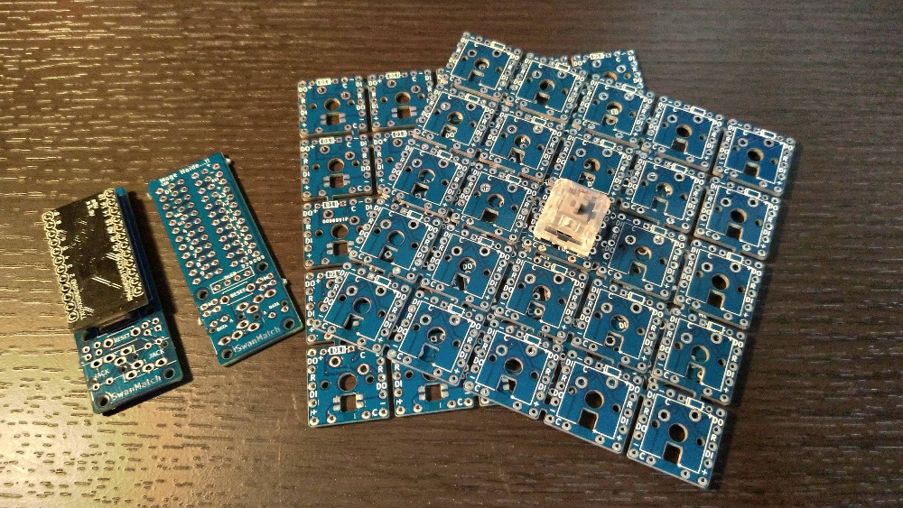
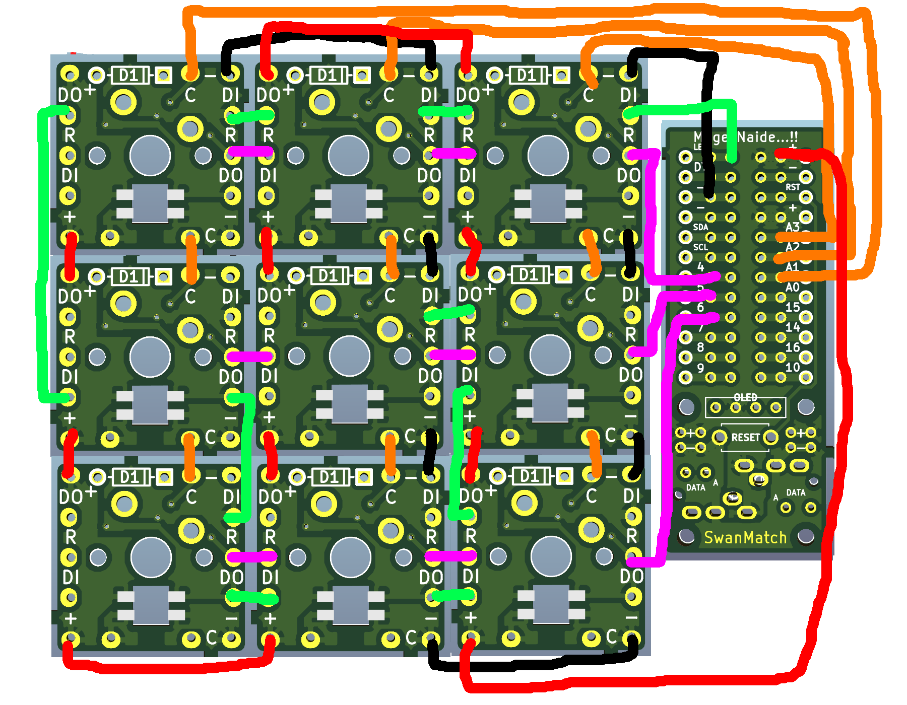

# infinite possibilities

[Cherry-Mx-Bitboard](https://github.com/ogatatsu/Cherry-Mx-Bitboard) is modified so that SK6812mini is addicted to helix.

Printed circuit board for self-made keyboard, one board corresponds to one switch. 

Using this board, you can create a full-color backlit keyboard with an original layout without designing the board.

For example ...!

[Click here for](https://swan-match.hatenablog.com/entry/2018/09/15/184923) details.

In addition, we disclosed [how](https://swanmatch.github.io/topplate-tips) to [make](https://swanmatch.github.io/topplate-tips) the [top plate](https://swanmatch.github.io/topplate-tips) .

[English](https://translate.google.com/translate?hl=ja&sl=auto&tl=en&u=https%3A%2F%2Fswanmatch.github.io%2FMxLEDBitPCB%2F&sandbox=1)

## Infinite possibilities series

### ProMicro House

A ProMicro pin that can be taken out, plus an OLED, reset switch, TRRS for split keyboard, and M2 screw holes for mounting.
 TRRS pin assignment is Helix compatible.

### Nexus

Unless the original 25 keys are disconnected, Col and Row and vertical VCC and GND do not require wiring.

Of course, it can be used even if separated.

### Altana

Pre-wired version like Nexus, and switchable version with Kailh socket.

## Material example (supplier)

- Arbitrarily cut plate
    - 2mm acrylic board (Yusha studio)
         It is good to have an adhesive such as 3mm acrylic timber and acrylic sundae. (Home center)
    - 3D case (DMM.make)
    - 5mm cardboard (such as picked up from there)
- Switching diode 1N4148 (TALPKeyboard)
- SK6812mini (Yusha studio)
- Urethane enameled wire (recommended is 0.35 to 0.45mm. It is also available at home improvement stores. It is possible to use vinyl wire, but it will melt or be quite difficult)
- TRRS jack, RESET button (Mr. Akizuki Denshi)
- OLED (optional, Yusha Kobo)
- Promicro (Yusha Kobo, TALPkeyboard)
- Various spacers and screws (Hirosugi Keiki, Wilco, etc.)
- Key switches, keycaps (Yusha Kobo, TalpKeyboard, etc. according to your preference)
- USB cable, TRS (3.5mm3 pole) cable

In addition, tools such as a temperature control soldering iron, tester, and tweezers are required.

## Pin assignment

The pinouts of the infinite possibilities are:

- C: Horizontal line (Col)
- R: Vertical line (Row)
- DI: LED control signal input (DataIn)
- DO: LED control signal output (DataOUT)
- -: Ground (for LED)
- +: VCC (5V for LED)

## Assembly procedure

1. Solder SK6812mini.
     Solder at about 220 ° C with a temperature-adjustable soldering iron.
     It will break if it is stuck.
     Use low-temperature solder with a melting point of 200 ° C or less.
2. Solder the diode.
3. Place the switch on the top plate and solder the switch legs with infinite possibilities on the back.
     (Altana is a socket.) If you use a 2mm acrylic board at this time, it is good to attach a 3mm acrylic material to the switch side on the back of the plate with acrylic adhesive to prevent the switch from coming off.
4. Wire the horizontal line (Col) and the vertical line (Row) according to the key matrix of the keyboard you want to build.
5. Connect all "-" and "+".
6. Wire the beads from DI to DO in the order you want the LEDs to shine. First DO → Second DI → Second DO → Third DI ...
7. Solder TRRSJACK and RESET switch.
8. Solder the OLED socket.
9. Wire Col and Row, LED (DO), GND, VCC from the hole next to any pin for each of the infinite possibilities.
10. Solder the Promicro to the socket.
     (Although you can use a con through, but it is cheaper to replace the whole socket if it breaks.)
11. Create and write firmware to your liking and complete.
     The firmware is very simple using [QMK_Firmware](https://github.com/qmk/qmk_firmware) .
     Reference: [Three types of means to prepare firmware for your own keyboard](https://skyhigh-works.hatenablog.com/entry/2018/10/09/120909)

## Wiring example

For example, if you have a 3 * 3 grid array, the wiring will be as follows.
 (If you do not disconnect the Nexus Altana, the wiring of Col, Row, vertical VCC and GND between the boards is unnecessary.)
 Urethane enameled wire (UEW) is quite difficult to peel off the film, so the wiring between adjacent boards where the possibility of short-circuiting is small may be a cut-off diode foot.
 The LED is wired spirally from the upper right.

### Notes

- Nexus Altana, which has been in circulation since April 2019, has already been wired with Col, Row and vertical power lines (VCC, GND).
- Altana is a version that allows you to replace the switch using a Kailh socket.
- If you don't need to illuminate the LED by all means, just wire Col and Row and it will work as a keyboard.
- In the case of sandwich-mounted keyboards, which are widely used in Japan, the top plate and the bottom plate are arranged with spacers, but in the case of infinite possibilities, there is no gap between the keys. Provide a screw hole on the outside of the key.
- If you solder the Promicro first to the “home,” when wiring to the infinite possibility, the solder may leak out of the hole and short-circuit parts of the Promicro body.
     Promicro should be soldered last.

## At the end

If you use this board to build a keyboard, please let us [know](https://twitter.com/swan_match) at [@swan_match](https://twitter.com/swan_match) .

I support your EndGame! !

## License

https://creativecommons.org/licenses/by/4.0/
